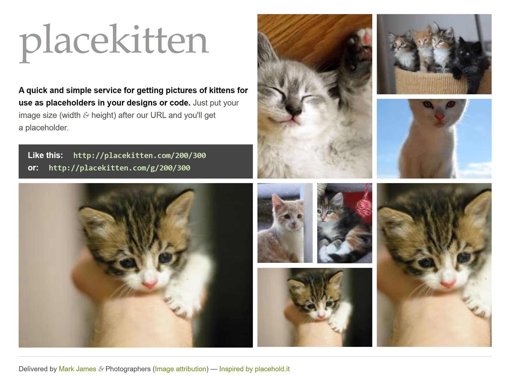

# Full-Stack Assignments

** Github Repo: https://github.com/tlan2/full_stack_assignments **
Contains all the assignment code

## Assignment 0

I signed up for our Slack channel and downloaded VS Code.

## Assignment 1

**Exercise 1** - Created HTML form.

**Exercise 2** - Recreated HTML elements from [http://placekitten.com/] (http://placekitten.com/).

**Exercise 3** - Made the HTML elements of a portfolio website. It included my name, a brief bio, a header, a footer, a section, an unordered list, three different types of headers, three photo elements, and a contact form.

## Assignment 2

**Exercise 1** - Copied previous assignment’s exercise 1 and styled it using CSS as per instructions.
**Exercise 2** - Copied previous assignment’s exercise 2 and styled the HTML elements to mirror [http://placekitten.com/](http://placekitten.com/).
**Exercise 3** - Copied previous assignment’s exercise 3 and added CSS style to the elements.

## Assignment 3

**Exercise 1** - Styled the contact form below using Boostrap elements.
**Exercise 2** - Recreated the color grid below using Boostrap.
**Exercise 3** - Implemented CSS Flexbox to recreate the layout below.
**Exercise 4** - Implemented Bootstrap for the layout below.
**Exercise 5** - Implemented CSS Grid for the layout below.
**Exercise 6** - Implemented CSS Grid for the layout below.
**Exercise 7** - Implemented CSS Grid for the layout below.

## Assignment 4

## Assignment 5

## Assignment 6

#### React Tutorial

#### Typescript Tutorial

#### Angular Tutorial
