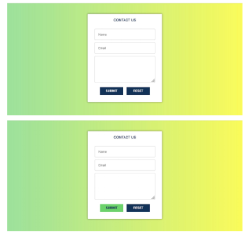
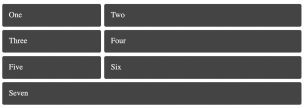

# Full-Stack Assignments

## Assignment 0 - Setup

I signed up for our Slack channel and downloaded VS Code.

## Assignment 1 - HTML

**Exercise 1** - Created HTML form.

**Exercise 2** - Recreated HTML elements from [placekitten.com/](http://placekitten.com/).

**Exercise 3** - Made the HTML elements of a portfolio website. It included my name, a brief bio, a header, a footer, a section, an unordered list, three different types of headers, three photo elements, and a contact form.

## Assignment 2 - CSS

**Exercise 1** - Copied previous assignment’s exercise 1 and styled it using CSS as per instructions.

**Exercise 2** - Copied previous assignment’s exercise 2 and styled the HTML elements to mirror [http://placekitten.com/](http://placekitten.com/).

**Exercise 3** - Copied previous assignment’s exercise 3 and added CSS style to the elements.

## Assignment 3 - CSS Layout and Bootstrap

**Exercise 1** - Styled the contact form below using Boostrap elements.

**Exercise 2** - Recreated the color grid below using Boostrap.

**Exercise 3** - Implemented CSS Flexbox to recreate the layout below.

**Exercise 4** - Implemented Bootstrap for the layout below.

**Exercise 5** - Implemented CSS Grid for the layout below.

**Exercise 6** - Implemented CSS Grid for the layout below.

**Exercise 7** - Implemented CSS Grid for the layout below.

## Assignment 4 - Javascript

**Exercise 1** - Wrote a FizzBuzz program to the the console.

**Exercise 2** - Wrote a function that reverses the digits in a number that prints to the console.

**Exercise 3** - Copied A3Ex1 Contact Form and added the functionality of printing the form results to the console.

**Exercise 4** - Created a webpage using Javascript that outputs the current width and height of the browser window. It dynamically changes when the window size changes.

**Exercise 5** - Used Javascript and HTML to  output a random background color and the color's hexadecimal value to a page each time the user clicks the button.

## Assignment 5 - Express

Created an Express server and middleware to handle the input and output of a form. The "submit" page prints out the information entered into the form.

## Assignment 6 - Node, Express, React, Angular, TypeScript, Vue

Completed the following tutorials (with the resulting code in the assignment 6 folder):

1. [React Tutorial](https://reactjs.org/tutorial/tutorial.html)

2. [Typescript Tutorial](https://angular-presentation.firebaseapp.com/angular/typescript/intro)

3. [Angular Tutorial](https://codelab.fun/angular/create-first-app/intro)
